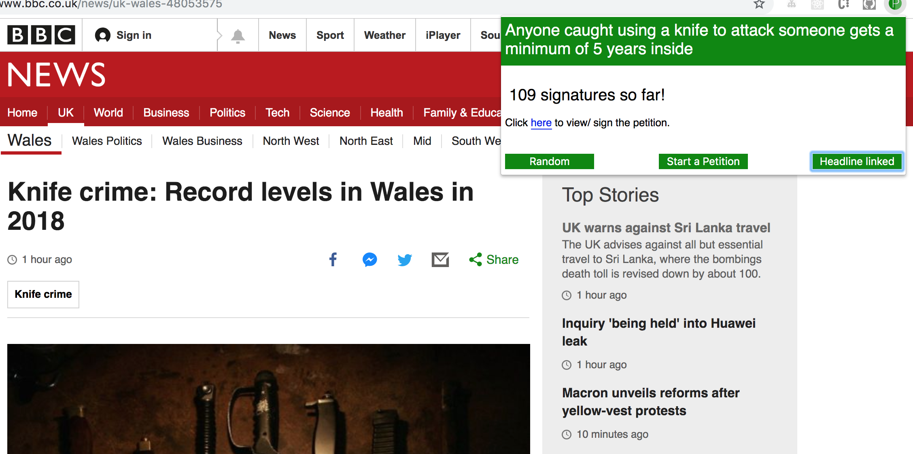

# Petitions Chrome Extension v.0.1.2


I had an idea to create a chrome extension that related to the government petition site and getting more people become active in so much as signing more petitions.

Currently on clicking the icon a popup occurs, loads the petitions in, then the user can select either a random petition, start a new petition or view the suggested headline based petition. It then displays the current signature count and gives the user an option to visit the page of the specific petition.

This extension can be used on any news website.

Currently published on the Chrome Store here: https://chrome.google.com/webstore/detail/news-to-petition/pkbiobdkinbilfodhicdhnedacnigikb

Note: Because of the long turn around with publishing on the chrome store, the published version on the store may not be the most up to date.

## Installation

`git clone git@github.com:LondonJim/Chrome-Extension-Petitions.git`

Currently to install you will have to enter developer mode on your chrome extensions page.

`chrome://extensions` in the browser to access chrome extension page

Toggle Developer Mode on the top right hand side of the browser

Click on `Load unpacked` and select the directory containing the extension, a green icon with a white x will appear top left of the chrome browser, clicking on it brings up the popup.

`npm install` to install testing frameworks CodeceptJS with Puppeteer and Jasmine helped by babel

## Recently Completed

```
As a user,
So I can see relevant petitions,
The petitions are based on a current news item I'm viewing.
```

This involves matching petition title text and petition paragraph text to the current page news item text. The user may see petitions that are completely against what they believe but will at least give them an idea of the petitions on the subject.

## Using cosine similarity to match headlines and petition content

Involves cleansing of the strings and using cosine similarity code from https://medium.com/@sumn2u/cosine-similarity-in-ember-js-2ba419d06462 to match headlines to petitions. Have used various string matrix algorithms and seem to be getting best results from the current code, although not perfect.

## Testing
`npm test` to run all tests back to back

#### End to End
`npm run test:e2e` to run

Uses CodeceptJS with Puppeteer. Getting the extension popup allowed involved added some extra chrome arguments to the `codecept.conf.js` file. Accessing the popup through the extension address in the tests, eg. `chrome-extension://jmpeikanbnofmekalgkadbeakbinkjni/popup/petitions.html`, with the long letter string being the chrome ID (displayed in `chrome://extensions`).

#### Unit and Integration
`npm run test:unit:integration` to run

Uses Jasmine. I had to add `@babel/plugin-proposal-class-properties` to `babel.config.js` as I was getting errors with the use of ES6 classes. Also I used `rewire` so I did not have to add module.export the classes in the files (which was not needed except for testing).

example:
```
let rewire = require('rewire')

let cleanseString = rewire('../../popup/src/cleanseString.js')

CleanseString = cleanseString.__get__('CleanseString')
```
Then I could use the `CleanseString` class and the static functions within it for testing.

Jasmine tests had to be executed through babel-node (`babel-node tests/unit/runTests.js`) to take advantage of the ES6 syntax.

`runTests.js`:
```
var Jasmine = require('jasmine');
var jasmine = new Jasmine();

jasmine.loadConfigFile('tests/unit/support/jasmine.json');

jasmine.execute();

```

## Production zip
To publish on the chrome store the project needs to be zipped.

`sh createzip` in terminal will create a zip files with all the necessary files in the root.

## Still to complete

```
As a user,
So I can view more than one relevant petition,
The headline based petitions can be offered in order of relevance
```

Refactoring, cleaning up code, specs

## Current examples



